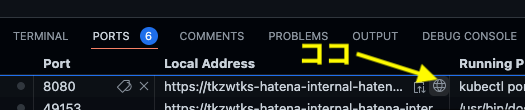

# [Hatena REMOTE INTERNSHIP 2022](https://hatena.co.jp/recruit/intern/2022)

「Hatena REMOTE INTERNSHIP 2022」では、Kubernetes上に構築されたブログシステムを題材としました。ブログシステムはマイクロサービスを意識しており、メインであるブログサービスに加えて、アカウントサービスや、Markdownなどの記法を変換するサービスが用意されています。それぞれのサービス間はgRPCを使ってやりとりしています。

<!--
インターンシップのカリキュラムについては、[レポートサイト](https://hatena.co.jp/recruit/intern/2022)や[課題](/docs/exercise.md)を公開しているので、参照してください。
-->

また、2021年に開催された [Hatena REMOTE INTERNSHIP 2021](https://hatena.co.jp/recruit/intern/2021) の題材としたブログシステムは[このリポジトリの2021ブランチ](https://github.com/hatena/Hatena-Intern-Kubernetes-Microservice/tree/2021)から参照することができます。

## ローカル環境でセットアップ
アプリケーションの起動には以下が必要です.

- [Docker](https://docs.docker.com/engine/install/)
  - Windows または macOS の場合は Docker Desktop
  - Linux の場合は各ディストリビューションごとのインストール方法に従ってください
- Kubernetes
  - [Minikube](https://kubernetes.io/docs/tasks/tools/install-minikube/)
- [kubectl](https://kubernetes.io/docs/tasks/tools/install-kubectl/)
- [Kustomize](https://kubernetes-sigs.github.io/kustomize/installation/)
- [Skaffold](https://skaffold.dev/docs/install/)

個々のサービスの開発には, 以下がローカル環境にインストールされていることを想定しています.

- Make
- [Go](https://golang.org/)
- (TypeScript を使う場合) [Node.js](https://nodejs.org/en/), [Yarn](https://classic.yarnpkg.com/lang/en/)

動作確認は以下の環境で行っています.

- macOS 12.5.1 (21G83)
- Docker Desktop 4.8.2 (79419)
- minikube v1.26.1

``` console
$ docker version
Client:
 Cloud integration: v1.0.24
 Version:           20.10.14
 API version:       1.41
 Go version:        go1.16.15
 Git commit:        a224086
 Built:             Thu Mar 24 01:49:20 2022
 OS/Arch:           darwin/arm64
 Context:           default
 Experimental:      true

Server: Docker Desktop 4.8.2 (79419)
 Engine:
  Version:          20.10.14
  API version:      1.41 (minimum version 1.12)
  Go version:       go1.16.15
  Git commit:       87a90dc
  Built:            Thu Mar 24 01:45:44 2022
  OS/Arch:          linux/arm64
  Experimental:     false
 containerd:
  Version:          1.5.11
  GitCommit:        3df54a852345ae127d1fa3092b95168e4a88e2f8
 runc:
  Version:          1.0.3
  GitCommit:        v1.0.3-0-gf46b6ba
 docker-init:
  Version:          0.19.0
  GitCommit:        de40ad0

$ minikube version
minikube version: v1.26.1
commit: 62e108c3dfdec8029a890ad6d8ef96b6461426dc

$ kubectl version --client
Client Version: version.Info{Major:"1", Minor:"21", GitVersion:"v1.21.2", GitCommit:"092fbfbf53427de67cac1e9fa54aaa09a28371d7", GitTreeState:"clean", BuildDate:"2021-06-16T12:52:14Z", GoVersion:"go1.16.5", Compiler:"gc", Platform:"darwin/amd64"}

$ $ kubectl version --client --output=json
{
  "clientVersion": {
    "major": "1",
    "minor": "24",
    "gitVersion": "v1.24.3",
    "gitCommit": "aef86a93758dc3cb2c658dd9657ab4ad4afc21cb",
    "gitTreeState": "clean",
    "buildDate": "2022-07-13T14:21:56Z",
    "goVersion": "go1.18.4",
    "compiler": "gc",
    "platform": "darwin/arm64"
  },
  "kustomizeVersion": "v4.5.4"
}

$ skaffold version
v1.39.2

$ go version
go version go1.19 darwin/arm64

$ node -v
v18.2.0

$ yarn -v
1.22.18
```

## 起動
### Minikube
以下の手順でアプリケーションを起動します.

``` shell
# Minikube を起動
minikube start --kubernetes-version v1.24.3 --driver docker
eval $(minikube docker-env)

# context を設定
kubectl config set-context hatena-intern-2022 --cluster=minikube --user=minikube --namespace=hatena-intern-2022
kubectl config use-context hatena-intern-2022

# 起動
make up
```

以下のコマンドを実行するとブラウザが自動的に開き, アプリケーションにアクセスします.

``` shell
minikube -n hatena-intern-2022 service blog
```

## Codespacesでセットアップ（インターン期間中はこちらを選択してください）

<details>
<summary>2022年のリモートインターンシップでは Codespaces による開発環境構築を利用しました</summary>

GitHub Codespacesを使って開発することが可能です．以下の手順でアプリケーションを起動してください．なお、MinikubeはCodespaces起動時に自動で起動するようになっているため、Minikubeの手順は参考情報です。

### Minikube起動（Codespaces起動時に自動で起動されます）

<details>

``` shell
# Minikube を起動

minikube start --kubernetes-version=v1.24.3 --driver=docker --memory='8g' --cpus=4
```

</details>

### contextの設定（Codespaces接続時に自動で設定されます）

<details>

```
kubectl config set-context hatena-intern-2022 --cluster=minikube --user=minikube --namespace=hatena-intern-2022
kubectl config use-context hatena-intern-2022
```
</details>

### アプリケーションの起動
```
make up
```
しばらく待つとアプリケーションが起動したログが出力されます
```
[blog] 2022-08-18T05:31:25.130Z INFO    blog/main.go:81 starting web server (port = 8080)
[renderer-go] 2022-08-18T05:29:04.420Z  INFO    renderer-go/main.go:50  starting gRPC server (port = 50051)
[account] 2022-08-18T05:30:42.721Z      INFO    account/main.go:64      starting gRPC server (port = 50051)
```
podが全て立ち上がっているかは以下のコマンドでも確認できます

```
kubectl get pods
```

```
NAME                            READY   STATUS    RESTARTS      AGE
account-59d777f778-5dgsj        1/1     Running   0             16m
account-db-86d4996fbf-nrf7m     1/1     Running   1 (14m ago)   16m
account-test-7b4b5b8c76-xsnww   1/1     Running   0             16m
blog-847564dc7-gkphp            1/1     Running   0             16m
blog-db-7dcfb8b56f-wpmmm        1/1     Running   0             16m
blog-test-7bdd4786c7-6bxj4      1/1     Running   0             16m
renderer-go-78d9f5cd8d-qx25p    1/1     Running   0             16m
```

### アプリケーションの確認
`make up`したターミナルと別のターミナルで、以下のコマンドを実行します。

```
kubectl port-forward service/blog 8080:8080
```

これにより8080番がフォワードされます．開いているターミナルの`port`タブの8080番ポートのローカルアドレスに表示されているアドレスにブラウザからアクセスします．



</details>

## サービス
アプリケーションには以下の 3 つのサービスが存在します.

- 認証基盤 (Account) サービス
  - ユーザーアカウントの登録や認証を管轄します
- ブログ (Blog) サービス
  - ユーザーに対して, ブログを作成したり記事を書いたりする機能を提供します
- 記法変換 (Renderer) サービス
  - ブログの記事を記述するための「記法」から HTML への変換を担います

このうちブログサービスが Web サーバーとして動作し, ユーザーに対してアプリケーションを操作するためのインターフェースを提供します.
認証基盤サービスと記法変換サービスは gRPC サービスとして動作し, ブログサービスから使用されます.

## ディレクトリ構成

- `pb/`: gRPC サービスの定義
- `services/`: 各サービスの実装
  - `account/`: 認証基盤サービス
  - `blog/`: ブログサービス
  - `renderer-go/`: 記法変換サービスの Go による実装
  - `renderer-ts/`: 記法変換サービスの TypeScript による実装
  - `fetcher-go/`: 追加課題用のサービスの Go による実装ひな形
  - `fetcher-ts/`: 追加課題用のサービスの TypeScript による実装ひな形
- `k8s/`: アプリケーションを Kubernetes 上で動作させるためのマニフェスト

## クレジット
- 株式会社はてな
  - [@akiym](https://github.com/akiym)
  - [@cockscomb](https://github.com/cockscomb)
  - [@itchyny](https://github.com/itchyny)
  - [@susisu](https://github.com/susisu)
  - [@astj](https://github.com/astj)
  - [@tkzwtks](https://github.com/tkzwtks)
  - [@SlashNephy](https://github.com/SlashNephy)

(順不同)

このリポジトリの内容は MIT ライセンスで提供されます. 詳しくは `LICENSE` をご確認ください.
