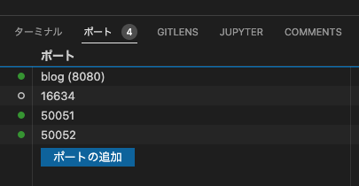

# 課題

Hatena SUMMER INTERNSHIP 2022では、用意されたブログシステムに追加の機能を実装してもらいます。ブログシステムは複数のサービスから成りますが、特に「記法変換サービス」を実装するのが、皆さんの課題です。

## 準備

### ブランチの用意

- [hatena/Hatena-Intern-2022](https://github.com/hatena/Hatena-Intern-2022)に、課題に取り組むために必要なコードがあります。このリポジトリで自分のはてなIDの名前のブランチを作成してください
- 課題に取り組む際は、最初に作った自分のはてなIDの名前のブランチをベースとして、そこからブランチを切る / そこにブランチをマージするという運用をお願いします
    - codespacesの支払いの関係でこうしています。少しやりにくい部分もあるかもしれませんが、ご協力ください 
    - 参加者のみなさんのベースブランチでprebuildの設定をしておきます。新しいブランチを作りたい場合は、まず自分のベースブランチでcodespaceを作り、その中で新規ブランチを作成するのがよいでしょう

### Codespacesでのセットアップ
Hatena SUMMER INTERNSHIP 2022の前半課程では、Codespacesを利用して環境を作り課題を進めていただきます。以下の手順でセットアップしてください。

1. `<> Code`ボタンを押し、codespacesタブを選択
2. `Configure and create codespace`を選択し、ボタンを押す
3. ブランチやスペックなどを選択し、`Create codespace`ボタンを押す
    - 項目は以下のように設定してください
      - `Region`: `Sourtheast Asia`
      - `Dev container configuration`: `.devcontainer/devcontainer.json`
      - `Machine-Type`: `8-core`
    - 以下のnotificationが表示されていることを確認してください（表示されていない場合、ご自身に課金されます）


4. しばらく待つと開発用のcodespaceが立ち上がる


## 課題

ブログシステムのコードはGo言語で書かれています。課題はGo言語もしくはTypeScriptで取り組むことを想定しています。しかしgRPCでやりとりできるなら、他の任意の言語で実装しても構いません。

### 必須課題: 記法変換サービス

ブログの記事をMarkdownで書けたら嬉しいと思います。そこで記事本文をなんらかの「記法」で装飾できるようにしてください。このとき、少なくとも以下の3つの記法を実装してください。

- 見出し記法
- リスト記法
- リンク記法

記法は[Markdown](https://commonmark.org/help/)をそのまま採用して構いません。それ以外の記法や独自に記法を作成しても構いません。Markdownを採用する場合、ライブラリを利用してもよいです。

参考までに、Go言語でライブラリを利用する場合は[goldmark](https://github.com/yuin/goldmark)を、TypeScriptでは[unified](https://github.com/unifiedjs/unified)（[remark](https://github.com/remarkjs/remark)、[rehype](https://github.com/rehypejs/rehype)）を推奨します。

テンプレートの中の[renderer-go](https://github.com/hatena/Hatena-Intern-2022/tree/main/services/renderer-go)サービス、もしくは[renderer-ts](https://github.com/hatena/Hatena-Intern-2022/tree/main/services/renderer-ts)サービスが出発点になるでしょう。

#### 発展

独自の記法を考えて追加してみましょう。自分がほしいと思えるような記法であると、なおよいです。

Markdownのライブラリを利用している場合も、上で推奨したライブラリであれば、拡張可能になっています。ドキュメントをよく読んで、うまく拡張してください。

## 追加課題

以下に挙げるものは追加課題A, Bは、必須課題を終えた後に少なくとも片方に取り組んでください。（もちろん両方に取り組むのも大歓迎です！）
時間と興味が許す限り取り組んでみてください。

### 追加課題A: タイトルの自動取得サービス

ブログの記事にリンクを載せたいときに、リンク先のタイトルを自動的に埋めることができたら、便利ではないでしょうか。リンク記法を拡張して、リンクテキストを省略した場合に、自動的にページタイトルが使われるようにしてください。Markdownであれば以下のような入出力になります。

入力: `[](https://example.com)`

出力: `<a href="https://example.com">Example Domain</a>`

ページタイトルを取得するのは、記法を変換することとは異なったビジネスドメインなので、独立したサービスとして実装してください。

ここで新しく作るタイトル取得サービスを`fetcher`とすると、実装は大まかに、以下のような手順で行うとよいでしょう。

- (`fetcher`サービスを作る)
- `fetcher`サービスがKubernetes上で起動するようにする
- `pb/fetcher.proto`にサービスのインターフェースを定義し、サーバー・クライアントのコードが生成されるようにする
- `fetcher`サービスに、ページタイトルを取得する実装を行う
- `renderer`サービスから適宜`fetcher`サービスを呼び出し、リンクテキストを適切に設定する

#### `fetcher`サービスを作る

本来であれば `./services/` 以下に新たに gRPC サーバーの実装を行い、Kubernetes 上で動かすための Dockerfile が必要です。
ただし、今回は `./services/` 以下にはあらかじめ、それぞれ Go と TypeScript によるサービスのひな形実装 (`fetcher-go`, `fetcher-ts`) が用意されています。
このひな形をそのまま使って構いません。（もちろん、使わずにゼロから作ってもらっても全く問題ありませんが...）

#### `fetcher`サービスがKubernetes上で起動するようにする

サービスをKubernetes上で起動するためには、Kubernetes講義で `renderer-ts` 実装を例にして説明されたように、`skaffold.yml`や`k8s/`以下のマニフェストを編集する必要があります。

まずは`./k8s/fetcher-go/`や`./k8s/fetcher-ts/`以下にマニフェストを用意する必要がありますが、`fetcher`サービスの参考実装のマニフェストは、`renderer`サービスと同様のマニフェストで起動できるようになっています。Kubernetes講義で`renderer-go`のマニフェストをコピーして`renderer-ts`のマニフェストを作ったのと同様に、自分が使いたい方のサービスのマニフェストを用意しましょう。

また、（これも`renderer-ts`を追加する際と同様に）`skaffold.yml`や`k8s/kustomize.yml`にも`fetcher`サービスのために追加する必要があります。

#### `pb/fetcher.proto`にサービスのインターフェースを定義し、サーバー・クライアントのコードが生成されるようにする

`fetcher`サービスのインターフェースは `pb/fetcher.proto` にひな形が用意されています。このファイルを編集して、サービスのために必要なインターフェースを定義しましょう。

今回のブログシステムでは、インターフェースのコード生成やそれぞれのサービスへのファイルコピーは`./pb/scripts/compile`で行っています。
インターフェースを定義した後は `pb` ディレクトリ上で `./scripts/compile` を実行するとコード生成が行われ、 `./services/fetcher-{go,ts}` にサーバーのコードがコピーされます。

```bash
$ ./scripts/compile
```

#### `fetcher`サービスに、ページタイトルを取得する実装を行う

実装しましょう！！！！

後述する「補足」にあるように、なるべくテストコードも書いてみてください。

#### `renderer`サービスから適宜`fetcher`サービスを呼び出し、リンクテキストを適切に設定する

`fetcher`サービスが実装できたら、`renderer`サービスからそれを呼び出す必要があります。
特にGoにおけるgRPCクライアントの利用方法やサーバーの呼び出し方法については、`./service/blog` にある `accountClient` や `rendererClient` が参考になるでしょう。
また、このドキュメントの末尾にも「参考」としてヒントが記載してあります。

#### 発展

- URLが20個並んだブログ記事を更新できるようにするために、どうすればいいいか考えて実装してください。
    - URLが100個、あるいは500個あるときはどうすればいいか、考えてみてください。
- タイトル取得サービスでは、外部のウェブサイトへリクエストを行います。このようなサービスを設計する際に、注意すべきことを考えましょう。
    - ウェブサイト運営者の立場に立って、困ることを考えましょう。
    - クローラーを実装するときに、どのような対応が必要でしょうか。
    - 例：リクエスト頻度、robots.txt、クロール禁止サイト（[Robots Beware](https://arxiv.org/help/robots)）

### 追加課題B: その他のアイデア

今回のブログシステムは非常にシンプルな機能を実装しており、またUIデザインも考慮されていません。このブログシステムに機能を追加して、ユニークかつ魅力的なブログサービスを作り上げてください。

使用する技術などに制約はありません。必須課題や、（取り組んだ人は）追加課題Aで実装した各サービスを活用しても構いませんし、全く関係のないおもしろ機能を開発しても構いません。

また、どんな機能を作ろうとしたかの説明もぜひ記載してください。Pull Requestに直接記載しても構いませんし、Scrapboxなどの書きやすい箇所に記載してURLをPull Requestに記載するのでも構いません。

## 補足

### テストについて

なるべくテストコードを書いてみましょう。

テストの目的の一つは、ソフトウェアの品質を保証することです。テストコードは、実装が正しいことを保証します。また、バグを修正した後に、修正されていることを確認するテストを書いておくことで、同じバグが再び起きていないことを将来にわたって保証することも可能です。

単に品質を保証するだけでなく、テストコードによって、テストの対象となるソフトウェアがどのように使われることを想定しているのか、示すこともできます。このようなテストコードはドキュメンテーションテストとして、ドキュメントの一部として扱われることもあります。

テストコードが果たすもう一つの役割は、生産性の向上です。ソフトウェアの動作を確認するのを、毎回人力でやっていると、手間がかかります。テストコードで自動化できると、とても便利です。ライブラリのアップデートのように、影響が広範にわたることが想定される場合、特に顕著です。

課題では、システムが複数のサービスに分けられています。全てのサービスを組み合わせないと動作が確認できない、となると大変です。個々のサービスを個別にテストできるように工夫してみましょう。

### コミットの大きさについて

コミットの粒度を意識して取り組んでみましょう。

全て実装してからまとめてコミットするようなやり方だと、gitのうまみが失われてしまいます。ひとつのコミットにどのような意味を持たせるのか考えて、適切なまとまりでコミットしてください。

ただしコミットログを気にして何度もrebaseするようなことは求めません。

### 開発の進め方について

チーム開発においては、自分が担当した部分をどのようにチームメンバーに共有するかという点も考える必要があります。はてなではGitHubを利用しており、ほとんどのチームで、機能ごとのブランチを作り、そこで作業を進め、Pull Requestを作り、レビュー後マージする、というやり方を採用しています。

Pull Requestの作り方も、コミットの粒度同様、機能のすべてを実装しきってからPull Requestにするのではなく、適度なまとまりでPull Requestにするのが良いでしょう。レビュアーの視点からみてもレビューしやすく、実装時にも「どういうコードが必要で、どのように実装を進めるか」の見通しを立てることに繋がります。

さらに、DraftのPull Requestを作り、現在の状況を共有し、他のメンバーと議論しながら開発を進めるという方法もあります。早いうちからDraftのPull Requestを作って進めていくことで、他のメンバーから進捗が見えやすくなります。また、未完成の段階から議論しながら進めることで、最終的に作りたい物と、実際に作られたものが乖離することを未然に防ぐこともできます。

Pull Requestを小さく、早い段階から作ることで、精度高く開発を進めることができます。前半課程は一人で進めることになるかと思いますが、是非これらのことを意識してほしいと思います。

## Tips

### gRPCサーバーにgRPCクライアントから接続する
- 50051/50052番ポートについて、あらかじめ`minikube - codespace`間と`codespaceからのport-forward設定を入れています
- ローカルマシンのターミナルを開き、以下のコマンドでgRPCクライアントからgRPCサーバーに接続できます
  - 以下の例では[hatena/docker-grpc_cli](https://github.com/hatena/docker-grpc_cli)を利用していますが、他のクライアントも利用できます
```
 docker run --rm hatena/grpc_cli:latest ls host.docker.internal:50051
 ```
### MySQLサーバーに接続する
- codespaceにMySQLクライアントをインストール済みです。
- 新しいターミナルを開き、以下でblog-dbに接続できます
```
mysql -uroot -h 127.0.0.1
```
- account-dbは3307番でport-forwardしています。新しいターミナルを開き、以下でaccount-dbに接続できます

```
mysql -uroot -h 127.0.0.1 -P 3307
```
### 新たに別のportをport-forwardしたい
#### minikube(kubernetes cluster) - codespace 間

skaffold.ymlに追記するか、`kubectl port-forward`します
- kubectl を使う
  - `kubectl port-forward service/blog 8080:8080`
- skaffold.yml に追記する
```yml
# portForwardセクションに以下のように追記する
# https://skaffold.dev/docs/pipeline-stages/port-forwarding/#UDPF
  - resourceType: service
    resourceName: blog
    port: 8080
    localPort: 8080
```
#### codespaceからのport-forward

以下の画像の「ポート追加」からport-forwardしたいポートを追加します



## トラブルシューティング

### make upに失敗する
- 再実行してください
- 何度やっても失敗する場合、codespace自体をもう一度作り直して試してください


## 参考

goldmarkを利用して、Markdownのリンク記法でリンクテキストが指定されていない際に、タイトルを差し込むコードの例

```golang
package main

import (
	"bytes"
	"fmt"
	"log"

	"github.com/yuin/goldmark"
	"github.com/yuin/goldmark/ast"
	"github.com/yuin/goldmark/parser"
	"github.com/yuin/goldmark/text"
	"github.com/yuin/goldmark/util"
)

var markdown = goldmark.New(
	goldmark.WithParserOptions(
		parser.WithASTTransformers(
			util.Prioritized(&autoTitleLinker{}, 999),
		),
	),
)

func main() {
	src := []byte("# link samples\n" +
	"[normal link](https://example.com)\n" +
	"[](https://example.com)\n")
	var buf bytes.Buffer
	if err := markdown.Convert(src, &buf); err != nil {
		log.Fatal(err)
	}
	fmt.Printf("%s\n", buf.String())
}

type autoTitleLinker struct {
	// fetcherCli pb.FetcherClient (ヒント)
}

func (l *autoTitleLinker) Transform(node *ast.Document, reader text.Reader, pc parser.Context) {
	ast.Walk(node, func(node ast.Node, entering bool) (ast.WalkStatus, error) {
		if node, ok := node.(*ast.Link); ok && entering && node.ChildCount() == 0 {
			node.AppendChild(node, ast.NewString([]byte(fetchTitle(string(node.Destination)))))
		}
		return ast.WalkContinue, nil
	})
}

func fetchTitle(url string) string {
	return "example title"
}
```

Node.js で gRPC クライアントを利用するサンプル

```typescript

import *  as util from "util";
import { FetcherClient } from "../pb/fetcher/fetcher_grpc_pb";
import { FetchPageTitleReply, FetchPageTitleRequest } from "../pb/fetcher/fetcher_pb";

// prepare client
const fetcherClient = new FetcherClient("localhost:50051", grpc.credentials.createInsecure());
// XXX: util.promisify だけでは型推論できなさそうなので強制的に形を指定する
type FetchPageTitleAsync = (arg: FetchPageTitleRequest) => Promise<FetchPageTitleReply>;
const fetchPageTitle = util.promisify(fetcherClient.fetchPageTitle).bind(fetcherClient) as FetchPageTitleAsync;

const req = new FetchPageTitleRequest();
// Request に `string url = n;` があるとする
req.setUrl("https://mackerel.io/");

const res = await fetchPageTitle(req);
// Reply に `string title = n;` があるとする
console.log(res.getTitle());
```
